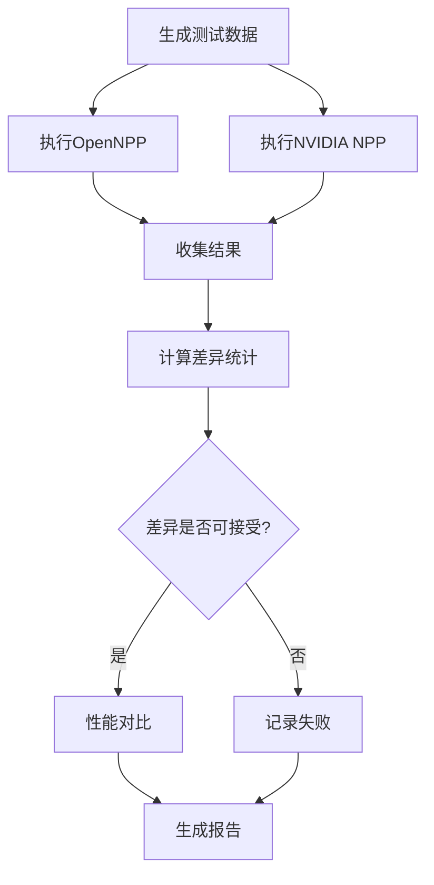
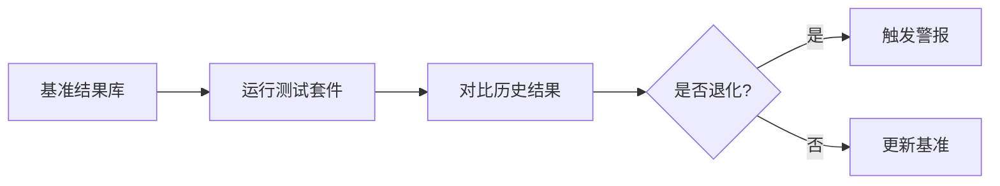

# OpenNPP与NVIDIA NPP一致性验证设计

## 1. 设计理念

### 1.1 核心目标
- **功能一致性**: 确保OpenNPP在所有情况下产生与NVIDIA NPP相同或可接受的结果
- **性能对等性**: 验证OpenNPP的性能不显著低于NVIDIA NPP
- **行为一致性**: 错误处理、边界条件等行为保持一致

### 1.2 挑战与解决方案

| 挑战 | 解决方案 |
|-----|---------|
| 浮点精度差异 | 设置合理的容差阈值，使用相对误差和绝对误差结合 |
| 整数舍入差异 | 允许±1的差异，特别是在有缩放因子的情况下 |
| 并行计算顺序 | 接受数值稳定范围内的差异 |
| 边界处理差异 | 专门测试边界条件，记录并接受合理差异 |

## 2. 容差策略

### 2.1 数据类型容差表

```cpp
// 整数类型容差
8-bit unsigned (Npp8u):   ±1
16-bit unsigned (Npp16u): ±1  
16-bit signed (Npp16s):   ±1
32-bit signed (Npp32s):   ±1

// 浮点类型容差
32-bit float (Npp32f):
  - 相对误差: 1e-5
  - 绝对误差: 1e-6
  
64-bit double (Npp64f):
  - 相对误差: 1e-10
  - 绝对误差: 1e-12

// 特殊情况
有缩放因子时: 容差 × 2
级联运算时: 容差 × 运算次数
```

### 2.2 容差计算公式

对于浮点数比较：
```
bool isEqual = (abs(a - b) <= absoluteTolerance) || 
               (abs(a - b) / max(abs(a), abs(b)) <= relativeTolerance)
```

## 3. 测试维度

### 3.1 数据模式测试

| 模式 | 描述 | 目的 |
|-----|------|------|
| RANDOM | 随机数据 | 通用情况验证 |
| GRADIENT | 渐变数据 | 测试连续性 |
| CHECKERBOARD | 棋盘格 | 测试急剧变化 |
| CONSTANT | 常量 | 测试特殊优化路径 |
| EDGE_CASE | 边界值 | 测试溢出处理 |

### 3.2 尺寸覆盖

```
微型: 1×1, 2×2, 4×4
小型: 32×32, 64×64
中型: 256×256, 512×512
大型: 1024×1024, 1920×1080
巨型: 4096×2160, 8192×4320

特殊尺寸:
- 质数尺寸: 1021×769
- 非对齐: 1023×767
- 极宽: 10000×10
- 极高: 10×10000
```

### 3.3 参数空间

- **常量值**: 0, 1, -1, 最大值, 最小值, 随机值
- **缩放因子**: 0, 1, 2, ..., 31
- **ROI**: 完整图像, 部分区域, 单像素
- **步长**: 最小对齐, 大步长, 非标准对齐

## 4. 差异分析

### 4.1 统计指标

```cpp
class DifferenceStatistics {
    double maxDiff;        // 最大差异
    double avgDiff;        // 平均差异
    double stdDev;         // 标准差
    double percentile95;   // 95分位数
    double percentile99;   // 99分位数
    map<threshold, count>; // 超过各阈值的数量
};
```

### 4.2 差异分类

| 级别 | 差异范围 | 处理方式 |
|-----|---------|---------|
| 完全一致 | 0 | ✅ 通过 |
| 可接受 | ≤ 容差 | ✅ 通过 |
| 轻微 | ≤ 2×容差 | ⚠️ 警告 |
| 显著 | > 2×容差 | ❌ 失败 |

### 4.3 差异可视化

```
差异分布直方图:
[0, 1e-6):    ████████████████ 95.2%
[1e-6, 1e-5): ██ 3.5%
[1e-5, 1e-4): █ 1.2%
[1e-4, 1e-3): | 0.1%
> 1e-3:       | 0.0%
```

## 5. 性能对比

### 5.1 性能指标

```cpp
struct PerformanceMetrics {
    double latency;      // 延迟 (ms)
    double throughput;   // 吞吐量 (GB/s)
    double speedup;      // 加速比
    double efficiency;   // 效率 (相对于理论峰值)
};
```

### 5.2 性能评级

| 加速比 | 评级 | 说明 |
|--------|------|------|
| < 0.5x | 🟢 优秀 | OpenNPP显著更快 |
| 0.5-0.9x | 🟢 良好 | OpenNPP较快 |
| 0.9-1.1x | 🟡 相当 | 性能相近 |
| 1.1-1.5x | 🟡 可接受 | OpenNPP稍慢 |
| > 1.5x | 🔴 需优化 | OpenNPP明显较慢 |

## 6. 测试流程

### 6.1 单元测试流程



### 6.2 回归测试流程



## 7. 错误处理一致性

### 7.1 错误码映射

| 场景 | NVIDIA NPP | OpenNPP | 验证 |
|------|------------|---------|-------|
| 空指针 | NPP_NULL_POINTER_ERROR | NPP_NULL_POINTER_ERROR | ✅ |
| 尺寸错误 | NPP_SIZE_ERROR | NPP_SIZE_ERROR | ✅ |
| 除零 | NPP_DIVIDE_BY_ZERO_ERROR | NPP_DIVIDE_BY_ZERO_ERROR | ✅ |
| 步长错误 | NPP_STEP_ERROR | NPP_STEP_ERROR | ✅ |

### 7.2 边界行为

```cpp
// 测试边界条件的一致性
TestCase boundaryTests[] = {
    {width: 0, height: 0, expected: NPP_SIZE_ERROR},
    {width: -1, height: 100, expected: NPP_SIZE_ERROR},
    {width: INT_MAX, height: INT_MAX, expected: NPP_MEMORY_ALLOCATION_ERR},
    {step: 0, expected: NPP_STEP_ERROR},
    {step: -1, expected: NPP_STEP_ERROR}
};
```

## 8. 自动化与CI集成

### 8.1 测试级别

| 级别 | 范围 | 运行时间 | 触发条件 |
|------|------|----------|----------|
| L0 - 冒烟测试 | 核心功能 | < 1分钟 | 每次提交 |
| L1 - 快速测试 | 基本覆盖 | < 5分钟 | PR/MR |
| L2 - 完整测试 | 全面覆盖 | < 30分钟 | 每日构建 |
| L3 - 压力测试 | 极限情况 | < 2小时 | 发布前 |

### 8.2 测试报告

```yaml
# 测试报告示例
test_suite: OpenNPP_Consistency_Validation
date: 2024-01-20
platform: NVIDIA RTX 4060
cuda_version: 12.3

summary:
  total_tests: 1024
  passed: 1018
  failed: 6
  pass_rate: 99.41%
  
performance:
  average_speedup: 0.98x
  best_speedup: 0.85x (SubC_8u)
  worst_speedup: 1.15x (DivC_32f)
  
consistency:
  perfect_match: 892 (87.1%)
  within_tolerance: 126 (12.3%)
  exceeded_tolerance: 6 (0.6%)
  
problematic_cases:
  - test: MulC_16s_ScaleFactor
    max_diff: 2
    tolerance: 1
    severity: minor
```

## 9. 持续改进

### 9.1 指标跟踪

- **一致性趋势**: 跟踪各版本的一致性变化
- **性能趋势**: 监控性能改进或退化
- **覆盖率**: 确保测试覆盖所有API

### 9.2 问题分类

| 优先级 | 描述 | 处理时限 |
|--------|------|----------|
| P0 - 阻塞 | 结果完全错误 | 立即 |
| P1 - 严重 | 超过容差 | 24小时 |
| P2 - 中等 | 性能退化>20% | 1周 |
| P3 - 轻微 | 轻微差异 | 下个版本 |

## 10. 最佳实践

### 10.1 测试编写原则

1. **可重现性**: 使用固定种子的随机数
2. **独立性**: 每个测试独立运行
3. **完整性**: 覆盖所有参数组合
4. **可读性**: 清晰的测试名称和输出
5. **高效性**: 避免冗余测试

### 10.2 调试技巧

```cpp
// 启用详细调试输出
export NPP_TEST_VERBOSE=1

// 保存失败案例的输入输出
export NPP_SAVE_FAILURES=1

// 运行特定测试
./test_consistency --gtest_filter="*AddC_8u*"

// 生成详细报告
./test_consistency --gtest_output=xml:report.xml
```

## 11. 结论

这个一致性验证框架提供了：

- ✅ **全面的覆盖**: 数据类型、尺寸、参数空间
- ✅ **精确的度量**: 统计分析和差异分类
- ✅ **自动化支持**: CI/CD集成和回归测试
- ✅ **可扩展性**: 易于添加新的测试用例
- ✅ **可维护性**: 清晰的结构和文档

通过这个框架，我们可以确保OpenNPP是NVIDIA NPP的高质量替代品，同时持续监控和改进一致性。